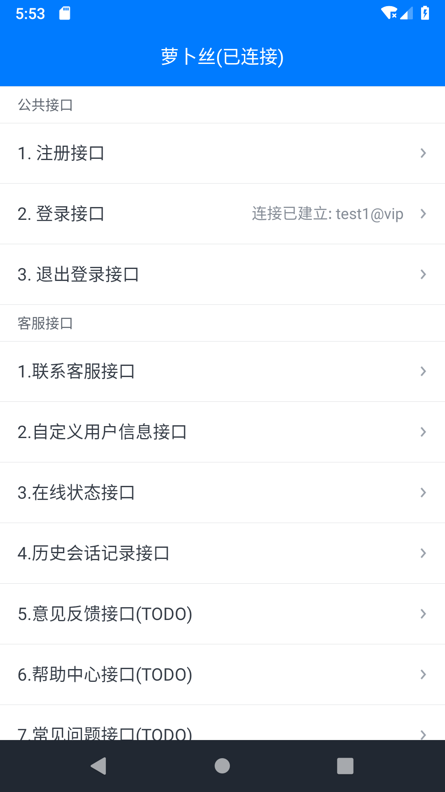
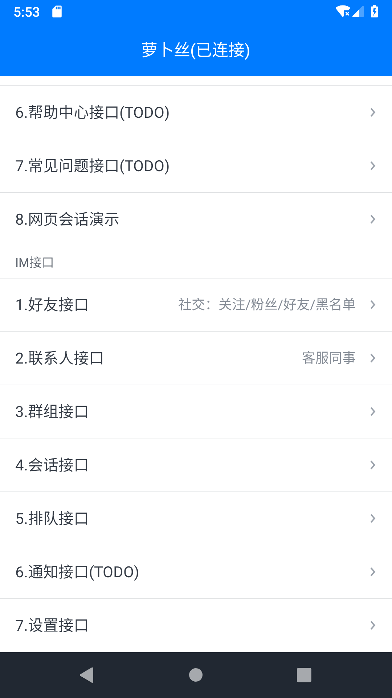
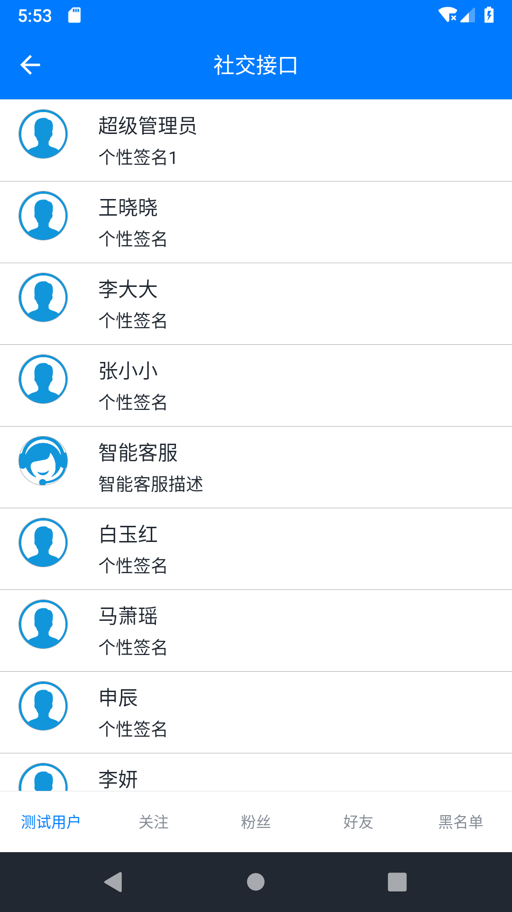
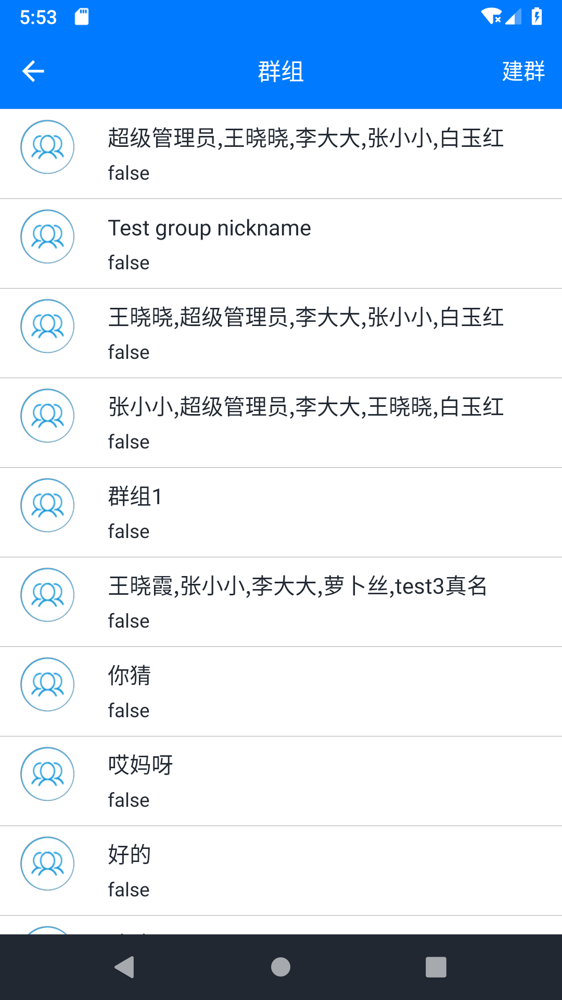
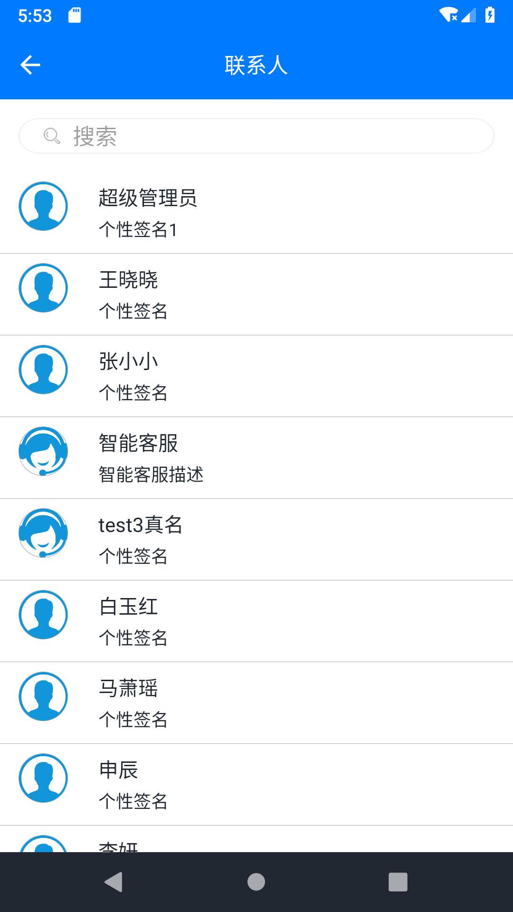
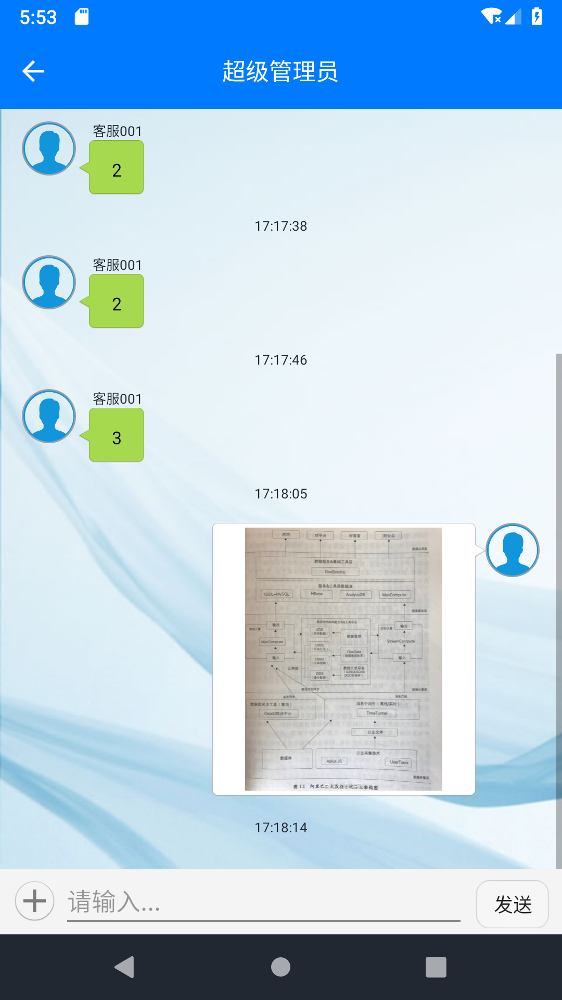
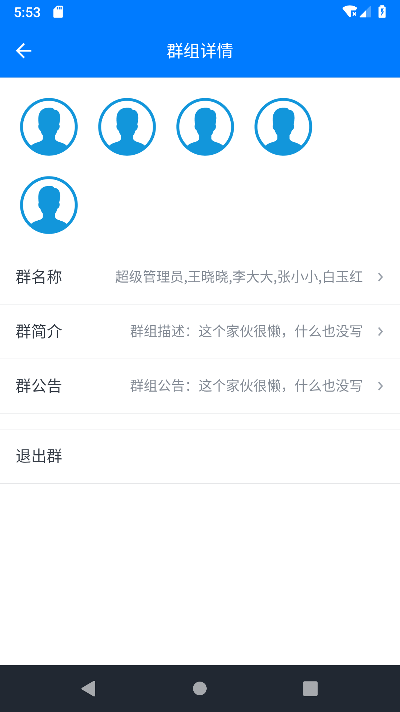

# 萝卜丝 · IM + 云客服

- 致力于提供稳定、可扩展、定制化的客户服务一站式平台
- [官方网站](https://www.bytedesk.com)
- [开发文档](https://github.com/bytedesk/bytedesk-android/wiki)

## 准备工作

- [注册账号](https://www.bytedesk.com/admin#/register)
- [登录后台](https://www.bytedesk.com/admin#/login)
- 分配应用：登录后台->所有设置->应用管理->APP

## 集成SDK

萝卜丝·云客服在经典版[微客服](http://www.weikefu.net)基础上面做了重构，将原先一个SDK一分为二为两个sdk：

<!-- - 核心库：com.bytedesk:core:  -->
<!-- - 界面库，完全开源(Demo中的bytedesk-ui模块)，方便开发者自定义界面：com.bytedesk:ui:  -->

## 开发文档

- [在线客服开发文档](https://github.com/bytedesk/bytedesk-android/wiki/%E5%9C%A8%E7%BA%BF%E5%AE%A2%E6%9C%8D%E5%BC%80%E5%8F%91%E6%96%87%E6%A1%A3)
- [IM开发文档](https://github.com/bytedesk/bytedesk-android/wiki/IM%E5%BC%80%E5%8F%91%E6%96%87%E6%A1%A3)

## 其他

- [iOS SDK](https://github.com/bytedesk/bytedesk-ios)
- [Android SDK](https://github.com/bytedesk/bytedesk-android)
- [Web端接口](https://github.com/bytedesk/bytedesk-web)
- [微信公众号/小程序接口](https://github.com/bytedesk/bytedesk-wechat)
- [服务器端接口](https://github.com/bytedesk/bytedesk-server)
- [机器人](https://github.com/bytedesk/bytedesk-chatbot)

## 截图

